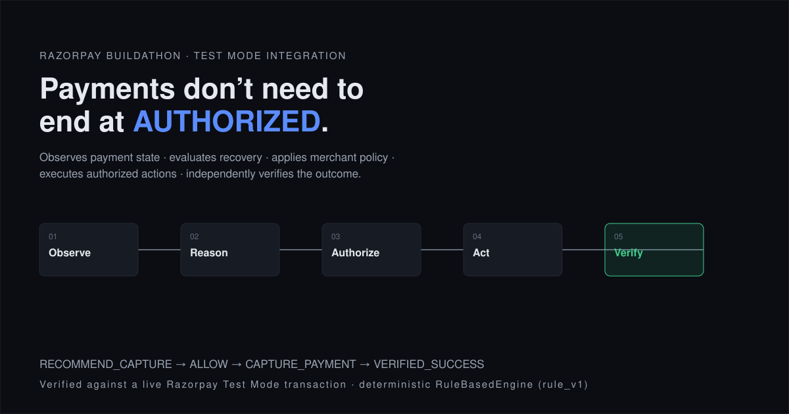

<p align="center">
  
</p>

# Payment Recovery Lab

**When a payment fails, Razorpay tells the merchant it failed. It doesn't say
which failures are worth chasing, what to do about each one, or when to stop.**

### → **[razorpay-decision-intelligence.onrender.com](https://razorpay-decision-intelligence.onrender.com)**

Four experiments, not a dashboard. You create real Razorpay Test Mode payments,
you decide which ones succeed, and the system reacts to what you actually did.
Nothing there is simulated.

*Free tier — if it's been idle, the first load takes ~50s to wake up.*

---

## Why not just turn on auto-capture?

That's a checkbox, and Razorpay already ships it. The hard question is upstream,
on **failures**: *what should happen next — and should anything happen at all?*

Do nothing and recoverable revenue evaporates. Run a blind retry cron and you
re-charge stolen cards, hammer issuers that already declined permanently, and
burn issuer trust chasing money that was never coming back.

What makes it hard: `error_reason` is too coarse to act on. One value —
`payment_failed` — covers a bank outage, a stolen-card block, and a bare
`"Payment failed."` Three failures, three different correct responses. **What
separates them exists only in the issuer's free-text description.**

---

## The receipt

Two runs, same 40-order backlog, **₹9,97,268.23 at risk**, fixed seed. The only
variable is whether the diagnosis layer was available.

| Outcome | With diagnosis | No model (control) |
|---|---:|---:|
| Automated retry prompt | 19 · ₹7,35,923 · 73.8% | **0** |
| Stopped by a rule | 15 · ₹1,96,241 · 19.7% | 2 · ₹16,968 · 1.7% |
| Escalated to a human | 6 · ₹65,104 · 6.5% | **38 · ₹9,80,300 · 98.3%** |

**Read the control column.** Removing the model doesn't automate *less* — it
automates **nothing**, and hands 98.3% of the backlog to a human. That's the
safety argument, measured instead of asserted.

---

## Where the AI is, and why it can't hurt you from there

It classifies **why a payment failed**. It decides nothing about money. Three
walls, all enforced by tests rather than by good intentions:

- **It doesn't know what's at stake.** The model is never told the amount —
  passing one is an *error*, not a silent drop. It can't be steered toward
  aggression on a big payment because it can't tell a big one from a small one.
- **It can't overrule a stop.** The retry-budget check runs *before* the
  diagnosis is read at all. Rule order is a security property here.
- **Degrading it produces humans, not robots.** No diagnosis, low confidence, or
  a self-contradictory result all route to escalation — that's the control column.

> **No model is called at request time.** Classification ran offline; the
> deployment replays it, and a cache miss escalates rather than guessing. Stored
> diagnoses are tagged `…/offline`, so a replay is distinguishable from a live
> call *in the database* — you don't have to take this file's word for it.

---

## Four experiments you can run yourself

| | | What you do |
|---|---|---|
| **01** | *An authorized payment needs a decision* | Pay a real ₹500 or ₹8,000 order in Razorpay's own Checkout. **The amount is the experiment** — one side of the merchant's limit captures automatically, the other doesn't. |
| **02** | *Is the gateway having trouble?* | Counts what recent payments actually did. Observed counts → arithmetic → interpretation, kept apart so the conclusion can be checked against its evidence. It never claims an outage it can't see. |
| **03** | *One payment failing, or many?* | Creates six real orders and **freezes them as a group before any is paid** — so the denominator can't drift from "4 of 6" to "4 of 9" once results land. |
| **04** | *Does past behaviour change the decision?* | Pay twice as the same payer. History can send a payment **to a human for review; it can never buy it more automation.** |

Creating an order moves no money — only a human completing Checkout produces a
payment, which is exactly why the outcomes are worth analysing.

**To fail one on purpose:** enter an OTP shorter than 4 digits. The site tells
you which test cards to use.

---

## What's real, enforced by the database

A `CHECK` constraint, not a promise: every batch must declare itself
`razorpay_test_mode` or `synthetic`. The label rides through to the UI as a
banner **there is no code path to omit**. Synthetic payments are only ever
`failed`, and no failed payment can reach the Razorpay write path — so the
synthetic set is *provably* free of external calls.

Recovery is reported as two numbers that are never merged: a **disposition** that
must partition every paisa at risk into exactly one bucket (*checked*, not
assumed), and **verified recovery** — only captures independently re-read from
Razorpay. `STOPPED` is money no longer being pursued, never money saved.

---

## Limitations

Kept current rather than allowed to drift upward. Full list in
[`docs/ARCHITECTURE.md`](docs/ARCHITECTURE.md).

- The classifier is **unvalidated on real traffic** — the corpus is small and
  single-author, so its accuracy is self-consistent by construction and is *not*
  evidence of capability.
- **Inference is offline.** No model is called at request time.
- Authorising a Test Mode payment needs a human in a browser, so **scale is
  demonstrated synthetically** — and labelled as such everywhere.
- Retry prompts have **no external effect** yet; wiring them up means Payment
  Links, which was scoped out.
- **Escalation is a queue, not a notification.** It records an outcome; it emails
  nobody.
- **No webhooks** — event ingestion is API-poll only.

<details>
<summary><b>Run or deploy it yourself</b></summary>

<br>

```bash
cd apps/api && python -m venv .venv && .venv/Scripts/pip install -e ".[dev]"
```

Add `DATABASE_URL`, `RAZORPAY_KEY_ID` and `RAZORPAY_KEY_SECRET` to
`apps/api/.env` (gitignored), then:

```bash
python -m db.run_migrations
python -m uvicorn api.app:app --port 8010 --app-dir src   # serves API + site
python -m pytest -q                                       # 441 passing
```

To deploy: Render → **New** → **Blueprint** → connect this repo.
[`render.yaml`](render.yaml) describes the whole product as one service and
prompts for those same three secrets — none is ever stored in git. Migrations
run in the build and are idempotent.

</details>

---

<p align="center">
  <sub><b>Razorpay Buildathon · AI Revenue Recovery</b><br>
  Every state the site shows comes from a real Razorpay operation, a real database record, or a real calculation.</sub>
</p>
